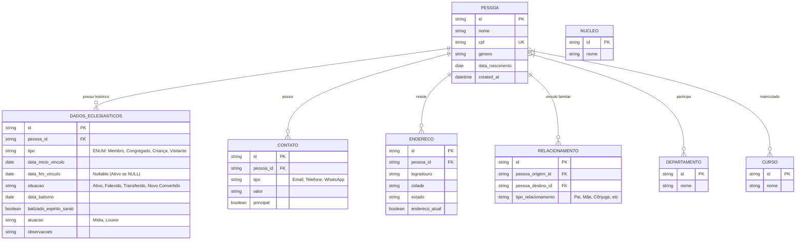

# Diagrama Entidade-Relacionamento Conceitual

Este digrama reflete o modelo refatorado para suportar histórico eclesiástico e dados normalizados de contato.

## Descrição das Mudanças

### Normalização
*   **DADOS_ECLESIASTICOS**: Substitui as tabelas `MEMBRO`, `CONGREGADO`, `VISITANTE`. Agora, uma mudança de status (ex: Visitante vira Membro) é apenas um novo registro nesta tabela, mantendo o histórico anterior.
*   **CONTATO e ENDERECO**: Saíram da tabela `PESSOA` para permitir múltiplos registros (ex: Telefone Residencial e Celular; Endereço Atual e Antigo).

### Identidade
*   **PESSOA**: Mantém apenas os dados vitais e imutáveis do indivíduo.
