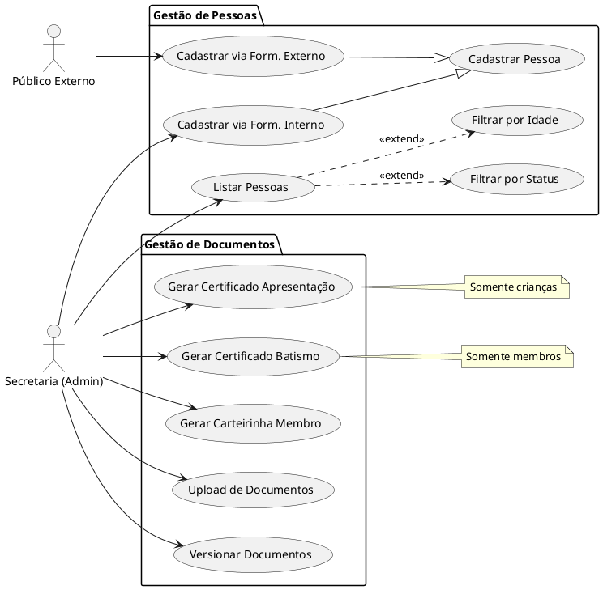

# Casos de Uso - Secretaria Digital

Baseado no PRD fornecido.

## Glossário

*   **Membros**: Pessoas batizadas e atuantes (Departamentos, Lideranças).
*   **Crianças**: Até 12 anos (Filhos de membros ou visitantes).
*   **Visitantes**: Visitam mas não são atuantes.
*   **Cursos**: Ensino com professor, pauta e certificado.
*   **Departamentos**: Organizações com líderes e tarefas (Obreiros, Intercessoras, Jovens, Mídia, Louvor, Sonoplastia).
*   **Núcleos**: Apoio na fé, semanal, com líder.

## Diagrama de Casos de Uso

## Requisitos Analisados

### Pessoas
1.  **Cadastro**:
    *   Membros, Crianças, Visitantes.
    *   Via Formulário Interno (Secretaria).
    *   Via Formulário Externo (Auto-cadastro/Público).
2.  **Listagem**:
    *   Filtros: Status, Idade.

### Documentos
1.  **Geração**:
    *   Certificado de Apresentação (Crianças).
    *   Certificado de Batismo (Membros).
    *   Carteirinha de Membros.
2.  **Gerenciamento**:
    *   Upload.
    *   Versionamento.
